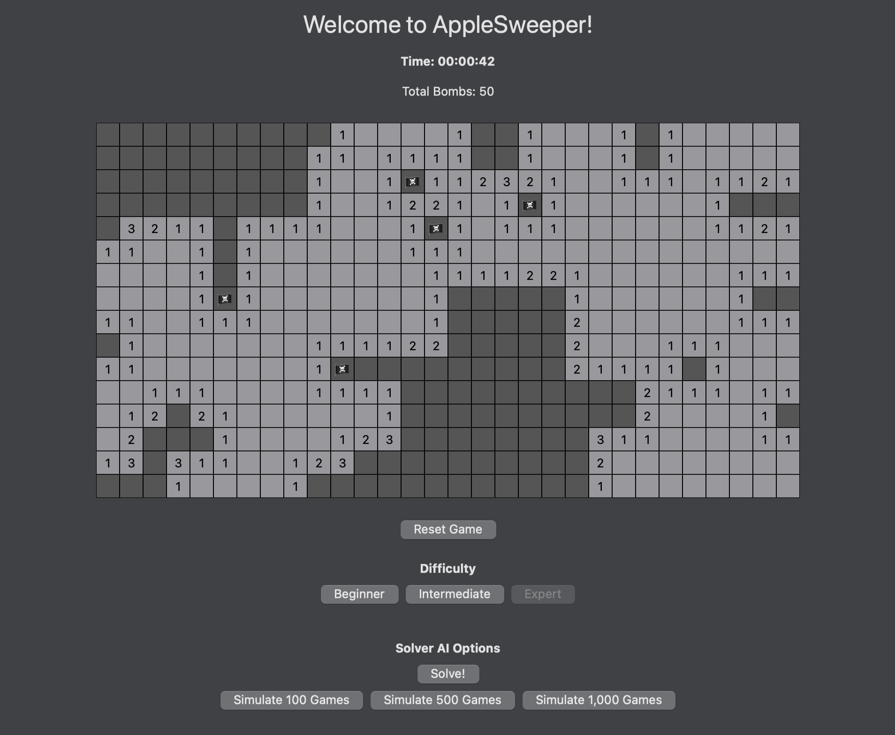

# AppleSweeper
My winning submission for the WWDC20 Swift Student Challenge!

This playground is a game called "AppleSweeper" and is a recreation of the traditional Minesweeper game using SwiftUI.
 
I worked very hard on the data structure of this playground to ensure that it would be elegant, concise, and efficient. I had to redesign it three times. It was a very interesting challenge coding a game using SwiftUI!

### Note
Please expand the playground view in order to see the full view. The playground is best experienced in dark mode, but is 100% functional and visible in light mode. If you cannot see everything vertically, you should be able to scroll.

 
## About Me
My name is Ethan Humphrey, and I have been coding since I was 10. I make iOS apps such as **Assigned!**, a helpful school planner, and the soon to be released **Run Mapper** to keep track of running routes. I am a part of the Class of 2020, and will soon be going off to college in hopes of pursuing my masters degree in computer science. I love Apple and hope to some day attend WWDC in person again!

 
## Game Rules
If you've never played Minesweeper before, the game is simple. There are bombs hidden across the board, and your job is to open all of the spaces on the board except for the bombs. You click on a space to open it. If it is a bomb, game over! If it is not a bomb, then the space will either be blank, or will have a number value. That number value corresponds to the number of bombs around that square. Any space with no bombs around it will "cascade" and open all adjacent spaces. Use your the number values and your logic to clear the board! (and don't worry, your first click will **never** be a bomb!)
 
### Controls
* Left Click: Opens a space
* Right Click: Marks a space. Useful for avoiding accidentally clicking a space which you believe to contain a bomb.
 
### Key
* Dark Gray: unopeneded space, proceed with caution
* Light Gray: Opened space, proceed carefree
* Numbered: Opened space with bombs around it, you'd better tread lightly
* 🏴‍☠️: You think there's a bomb here?
* 💣: You clicked a bomb and lost the game, what a shame...
 
### Difficulties
The game generates with the expert map initially to ensure it is sized correctly, but feel free to start with Beginner! These are scaled similarly to the original Minesweeper difficulties.

 
## Solver
One of the main features of my playground is the algorithm I developed to solve any game of AppleSweeper. In my tests, I achieved a 92.6% accuracy for the algorithm. The reason this can never be 100% accurate is because inevitably, AppleSweeper will present a situation which requires guessing. If you don't believe my numbers, feel free to test them! I added the ability to run simulations to test accuracy right within the playground. Since this runs on a separate thread, feel free to continue playing the game while it is running!
 
 ### Note
Unless the game is started by the user, the timer will not time the solver. This is because the algorithm solves the game in under a second, but is purposefully slowed down for visual enjoyment, so timing the solver in this way would be inaccurate.
 
 ## Have Fun!
